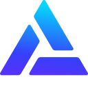
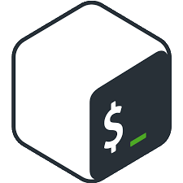
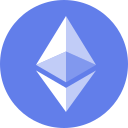
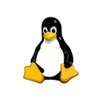
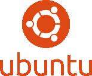
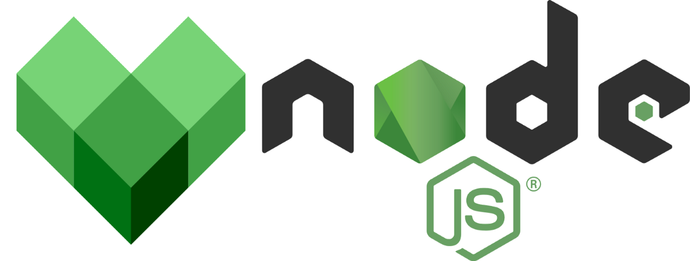

<h1>Decentralized Apps developer based in Ukraine.</h1>

-   👋 Hi, I’m @ValerianLukashyk
-   👀 I'm a digital enthusiast and at the moment I'm fully immersed in the world of blockchain, contributing to the study and development of decentralized pages, applications or simply the metauniverse..
-   📫 Feel free to contact me for collaboration.

<h1>What I'm doing right now:</h1>

<ul>
  <li>
ERC20, ERC721 smart contracts
</li>
  <li>
DApps for NFT projects like games, collectibles sites, marketplaces etc
</li>
  <li>
Bots
</li>
  <li>
VR
</li>
  <li>
AI
</li>
</ul>
  

  
  
  
  
  
  
  
  
  
  
  

<!---
ValerianLukashyk/ValerianLukashyk is a ✨ special ✨ repository because its `README.md` (this file) appears on your GitHub profile.
You can click the Preview link to take a look at your changes.
--->
